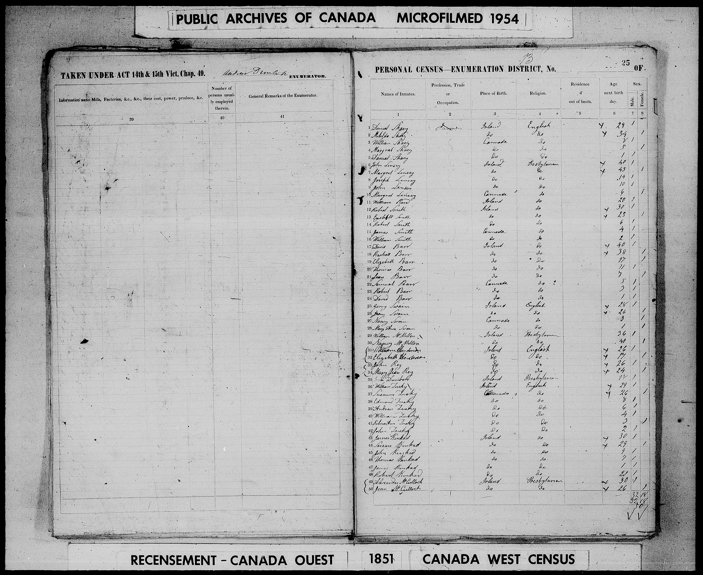
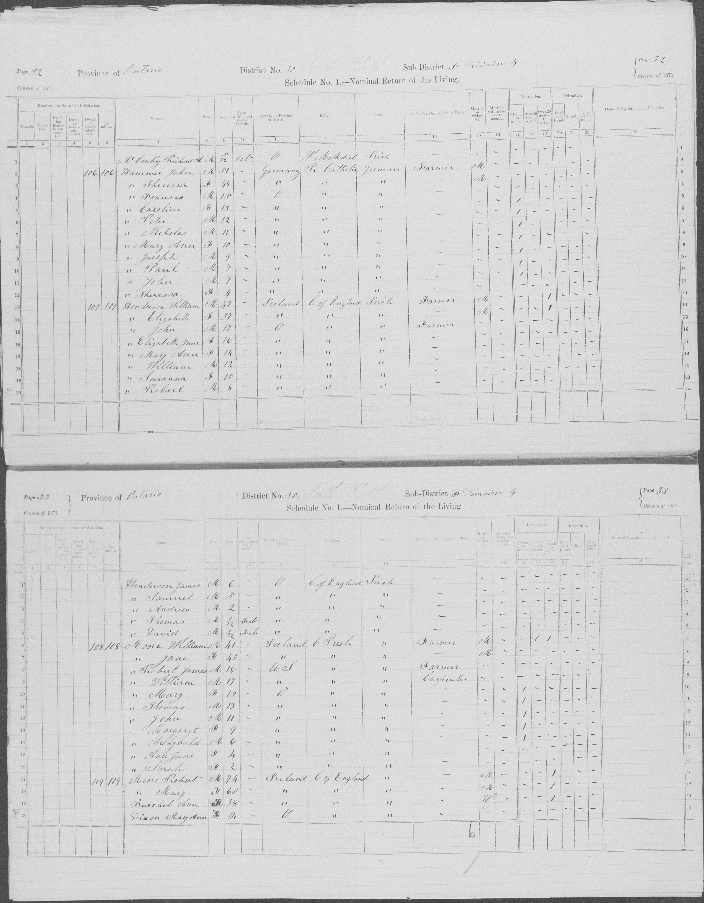

+++
title = 'Henderson'
date = 2024-12-20T20:53:03-07:00
draft = false
+++

> *We have received another solemn warning to prepare for eternity in the death of a respected friend*





 

## References
1. https://www.canadiana.ca/view/oocihm.N_00005_18780426/2
2. https://www.familysearch.org/tree/person/about/L4K6-KQG
3. https://recherche-collection-search.bac-lac.gc.ca/eng/Home/Record?app=immbef1865&IdNumber=15608&q=henderson&ecopy=31187_177416-00866