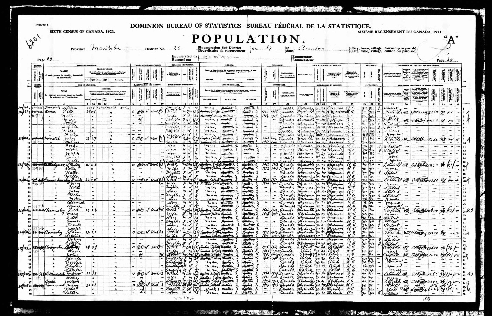

+++
title = 'Komarzyca'
date = 2024-12-16T19:06:27-07:00
draft = false
+++


```
Line 18
Peter Komarzyca and Anelia Komarzyca (née Dworniak)
    Address: 2505 Macdonald Ave. Brandon, Manitoba
    DOB: June 1883 and October 1884
    Nativity: Galicia
    Immigrated: 1903 and 1904
    Naturalized: 1909
    Ethnicity: Galician
    Language: Ruthenian
    Religion: Greek Catholic
    Profession: Carpenter and none
```

```
Line 2
Peter Komar and Nellie Komar
    Address: 2505 Macdonald Ave. Brandon, Manitoba
    Age: 36 and 35
    Nativity: Galicia
    Immigrated: 1903 and 1904
    Naturalized: 1908
    Ethnicity: Ukrainian
    Language: Ukrainian
    Profession: Fireman and none
```












## References